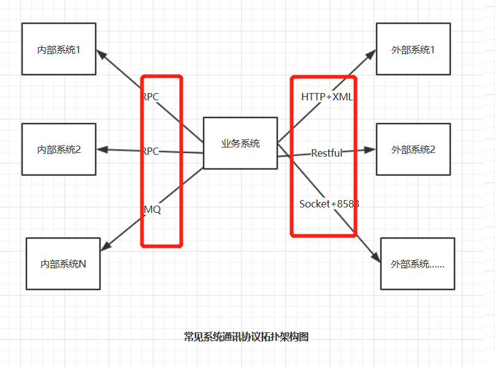
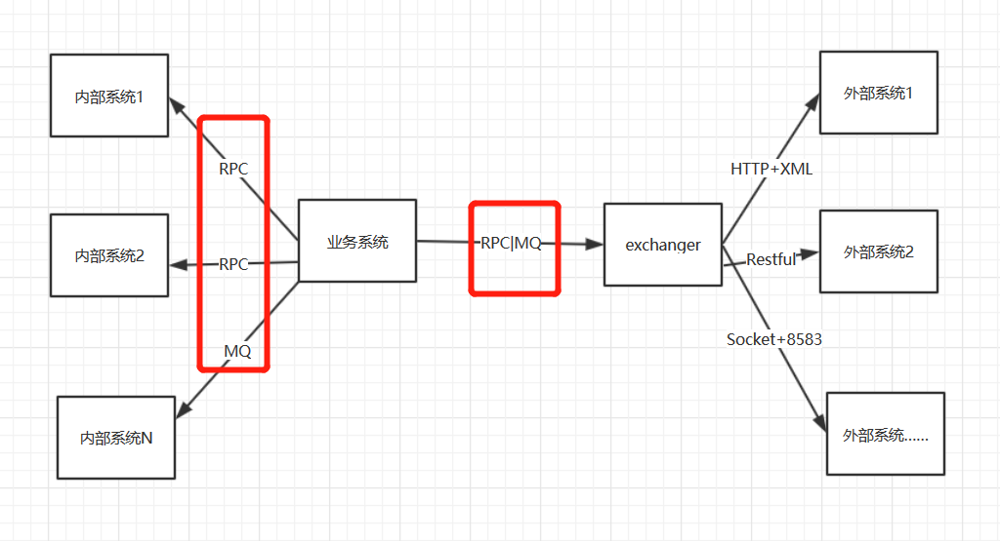

# exchanger
渠道网关

 ## 普通-分布式-系统协议-拓扑架构图。 
 

这种架构为系统开发带来很多问题   
1，每个系统要实现N种通讯协议，报文协议等，开发工作量很大   
2，耦合进来的N种通讯协议，报文协议等，有些为特定版本的工具包，会形成jar冲突。
 为核心系统带来稳定性隐患。   

 ## 良好-分布式-系统协议-拓扑架构图

 
 
 这种架构下   
 1，每个业务系统只需要关注PRC通讯协议， 和Map报文结构    
 2，系统组成结构简单，只需引入一个exchanger-client.jar    

 ## 简化渠道接入工作
 
 接入渠道的工作，从以前的开发变成接近纯配置工作
 
 
| 交换码 | 协议 | url | 证书 | 编码 | 报文解析器 | 渠道参数 |备注 |服务模式|
|----|----|----|----|----|----|----|----|----| 
| cmb-pay | https | https://..... | abc.cer | cmb-pay-assempare | GB18030| {timeout:10} | |CLIENT | 
 

 

